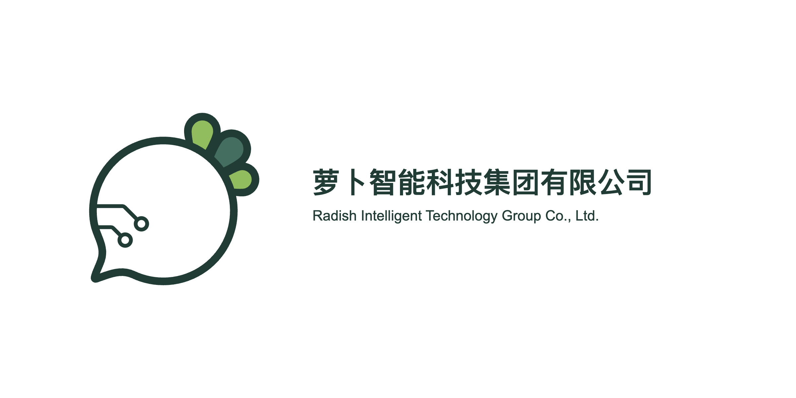

# 萝卜智能 · Radish Intelligence

由个人发起和维护的 Radish 项目系列，探索社区、游戏、工程工具与 AI，也关注日常输入、个人记忆和团队协作。

我们希望把想法做成能够持续使用、不断改进的产品。每个项目围绕具体问题独立建设，在共同的 Radish 品牌下持续成长。

> 🌱 **成立于 2026 年 10 月 1 日**
>
> 这一天，Radish Intelligence GitHub 组织正式建立。以此为记，继续把想法做成作品。

[系列官网](https://radishx.com/) · [维护者](https://github.com/laugh0608) · [联系邮箱](mailto:email@radishx.com)

## 暂定公司名称与 Logo

> **暂定方案说明：目前尚未成立公司，Radish 项目系列仍由个人发起和维护。以下公司名称仅为拟用名称；中英文名称、品牌名、简写及 Logo 均为暂定方案，后续可能随时更改，不代表已注册或已成立的公司。**

| 项目 | 暂定内容 |
| --- | --- |
| 拟用中文公司全名 | 萝卜智能科技集团有限公司 |
| 拟用英文公司全名 | Radish Intelligent Technology Group Co., Ltd. |
| 中文品牌名 | 萝卜智能 |
| 英文品牌名 | Radish Intelligence |
| 品牌简写 | RI |
| Logo | 第九稿（V9），2026-09-27 选定的暂定基准 |

## 项目一览

| 项目 | 方向 |
| --- | --- |
| [Radish](https://github.com/laugh0608/Radish) | 面向兴趣与创作者群体的现代社区，连接创作、讨论与知识沉淀。 |
| [RadishCatalyst](https://github.com/laugh0608/RadishCatalyst) | 异星化工生产经营游戏，让探索中的发现逐步转化为工业生产能力。 |
| [RadishFlow](https://github.com/laugh0608/RadishFlow) | 以 Rust 为计算核心的可扩展流程模拟平台，面向工程建模与求解。 |
| [RadishMind](https://github.com/laugh0608/RadishMind) | AI 应用、工作流与模型集成平台，围绕受控运行、结果审查与验证组织工作。 |
| [RadishLex](https://github.com/laugh0608/RadishLex) | 本地优先的中文输入系统，围绕离线输入、个人化与隐私保护持续建设。 |
| [RadishAxiom](https://github.com/laugh0608/RadishAxiom) | 面向 AI Agent 的验证优先语言与可信语义层。 |
| [RadishLink](https://github.com/laugh0608/RadishLink) | 离线自组网通信设备与协议探索，关注无互联网场景下的小队联系。 |
| [RadishMemory](https://github.com/laugh0608/RadishMemory) | 用户拥有、模型无关的个人长期记忆与上下文系统。 |
| [RadishNexus](https://github.com/laugh0608/RadishNexus) | 面向研发团队、自部署优先的沟通、协作与交付枢纽。 |

[RadishAxiomChecker](https://github.com/laugh0608/RadishAxiomChecker) 是 RadishAxiom 配套的独立语义与证据检查器，与 Axiom 共同构成一个产品。

各项目处于不同建设阶段，具体能力、可用版本和参与方式请查看对应仓库的 README、文档与发布记录。

## 官网与品牌

[RadishX](https://radishx.com/) 是整个系列的官网与统一入口，提供项目介绍、联系方式，以及虚拟形象“萝小白”的展示。官网源码位于 [RadishX 仓库](https://github.com/laugh0608/RadishX)。

## ❤️ 我们的成员

一起把想法做成作品。

  
  
  
  
  
  

## 交流与参与

- 问题反馈与功能建议：请前往对应项目仓库，按其说明参与；已开放 Issues 的项目可直接提交反馈。
- 项目交流与合作：[email@radishx.com](mailto:email@radishx.com)。
- 维护者：[laugh0608](https://github.com/laugh0608) · [个人主页](https://www.imbhj.com/)。
- 微信公众号：**大白萝卜的坑**，分享项目动态与开发记录。

代码、文档与品牌素材的使用范围以各仓库的许可证和相关说明为准。
